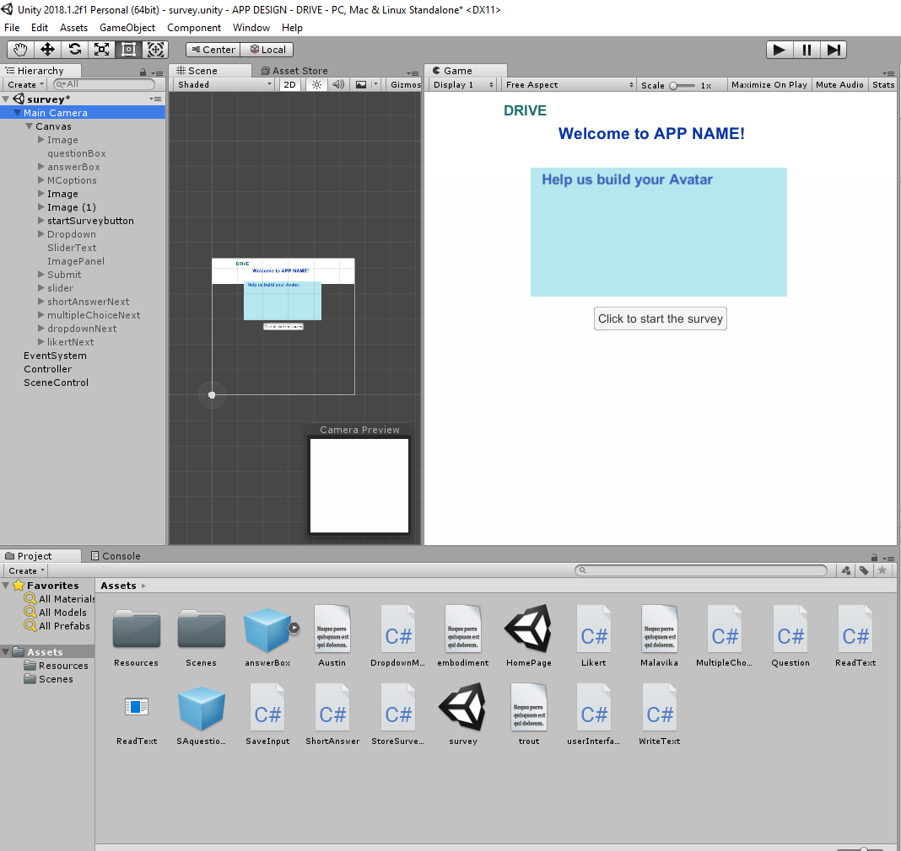
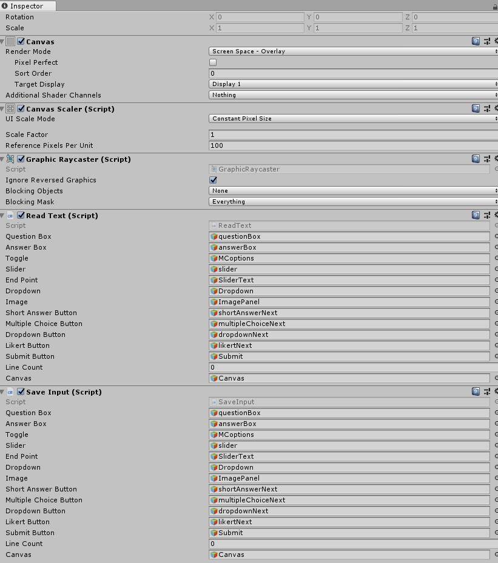
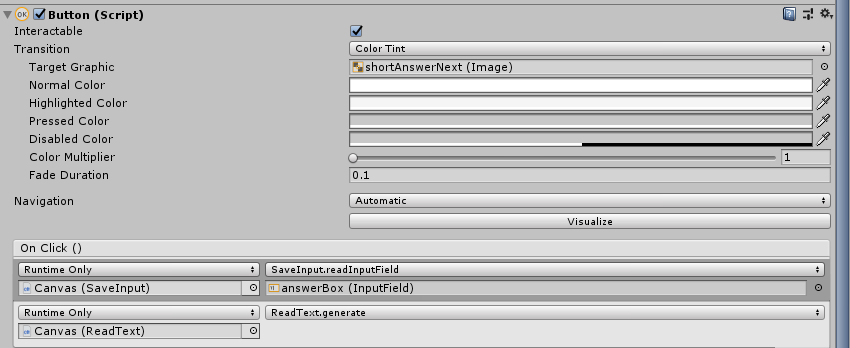

# Survey-Implementation-for-VR-Environments
> This project will help create an automated survey application that can be taken by research participants in a virtual environment. The survey can be generated by modifying the input text file according to the survey owner's requirements. When the participant completes the generated survey, an output file containing the user responses will be generated. This project also enables an easy collection of data for future VR experiments.

## Table of Contents
* [General Info](#general-information)
* [Technologies Used](#technologies-used)
* [Features](#features)
* [Setup](#setup)
* [Usage](#usage)
* [Project Status](#project-status)
* [Room for Improvement](#room-for-improvement)
* [Acknowledgements](#acknowledgements)
* [Contact](#contact)
<!-- * [License](#license) -->

## General Information
- VR research experiments and studies generally require extensive use of surveys to collect participant information and data. Some VR experiments would also require participants to embody an avatar and answer questions in a virtual environment to study any effects caused by virtual embodiment. This project aims to provide an automated survey application that will enable researchers to conduct surveys in virtual environments. 
<!-- You don't have to answer all the questions - just the ones relevant to your project. -->

## Technologies Used
- Unity - version 2018.1.2f1 (64bit)
- Microsoft Visual Studio 

## Features
List the ready features here:
- Provides four different types of questions that can be included in the survey: short-answer, multiple choice, likert scale and dropdown menu. 
- Only requires user to modify the input text file according to the required questions.
- Generates an output file storing the participant's answer along with the corresponding question.

## Setup

This is how the Unity screen layout looks like before you enter the playmode to begin the survey. The design was made for a cleaner layout however it is subject to change. To setup the project, you may do the following steps and create the game objects that will be used by the C# scripts:
1. Create a new project on UnityEngine. Under the main camera, start by adding a UI Canvas which will serve as the parent game object. All other game objects will be      created under the Canvas.
2. Add a UI Text which can be referred to as the question box. This will serve as the placeholder for all the questions that need to be displayed. 
3. For short-answer questions, add a UI Input Field which can be referred to as the answer box. This will serve as the placeholder for any answers entered by the user. 
4. For multiple-choice questions, add a UI Toggle which can be referred to as MC options. This will serve as the placeholder for all the options the user can choose      from for a multiple-choice question.
5. For likert-scale questions, add a UI Slider which can be referred to as slider/likert slider. This will serve as the placeholder for the likert scale where the user    can drag values on. Add a UI text which can be referred to as slider text. This will serve as the paceholder to denote the two endpoints of the likert scale.
6. For dropdown questions, add a UI Dropdown which can be referred to as dropdown/menu. This will serve as the dropdown menu holding all the options provided to the      user for dropdown questions. 
7. For questions that include an image, add a UI Raw Image which can be referred to as image panel. This will be the placeholder for the respective image that needs to    be displayed. 

After all the game objects have been set up to represent components of each question, we need to add buttons that will help us switch between different types of questions with ease. Since each answer type is also different, the buttons will also help with storing the corresponding type of answer. Here are the following steps to set up the buttons: 
1. Add a UI Button that can referred to as start survey button. This button will start the survey by changing the screen and displaying the first question. 
2. Add a UI Button that can be referred to as short answer next. This button will appear when your screen displays a short answer type question. When it is clicked,      it will be responsible for storing the user response from the input field and generating the next question.
3. Add a UI Button that can be referred to as multiple choice next. This button will appear when your screen displays a multiple choice type question. When it is          clicked, it will be responsible for storing the toggle option that the user has selected and generating the next question.
4. Add a UI Button that can be referred to as likert next. This button will appear when your screen displays a likert type question. When it is clicked, it will be        responsible for storing the value on the slider dragged by the user and generating the next question.
5. Add a UI Button that can be referred to as dropdown next. This button will appear when your screen displays a dropdown type question. When it is clicked, it will be    responsible for storing the option chosen by the user from the dropdown menu and generating the next question. 
6. Lastly, add a UI Button that can be referred to as submit. This button will appear after all the questions have been answered. When it is clicked, it will be          responsible for creating a file named after the user with all the stored responses and exiting out of the playmode to end the survey. 

## Usage
After the required game objects have been set up in UnityEngine, we need to attach some scripts that the game objects will implement when you enter the playmode. Add all the C# scripts provided in this project to your Assets folder of your Unity Project. 
- Click on the Canvas Object and in the Inspector > click on Add Component and add the ReadText.cs script or simply drag it to the inspector to attach it to the         Canvas. Similarly, add the SaveInput.cs as a second component. Once you have attached both the scripts, drag each game object to fill in the parameters of the         scripts. This helps ypur C# script know which GameObject to use while running the code. (see image provided below for reference)

  
  The following steps will explain how to attach the required functions on each button:
1. In the 'On Click' component of your 'start survey' button, drag the Canvas Game Object and select ReadText to finally attach the ReadText.generate() function call.     This will tell the button to call the respective function when it is clicked. 
2. In the 'On Click' component of your 'short-answer next' button, drag the Canvas Game Object and select SaveInput to attach the SaveInput.readInputField() function     call. Then if your function has a parameter, drag the respective object to pass in the parameter. In this case, drag the game object InputField (i.e. answer box).     Click the '+' icon in the  'On Click' section to add another function call: drag the Canvas Game Object and select ReadText to also attach the ReadText.generate()     function call. The order is important because now when you click this button, it will store the answer entered by the user and then generate the next question. 
  This is what it will look like in the Inspector. You will replicate this process for the buttons of other questions.
  
3. In the 'On Click' component of your 'multiple choice next' button, drag the Canvas Game Object and select SaveInput to attach the SaveInput.readSelectedToggle()        function call. Then add another function call for ReadText.generate() similar to what you did in step 2. When this button is clicked, it will store the selected        toggle option and generate the next question.
4. In the 'On Click' component of your 'likert next' button, drag the Canvas Game Object and select SaveInput to attach the SaveInput.getSliderValue() function call.      Drag the game object Slider (i.e. slider/likert slider) to pass in the parameter. Then add another function call for ReadText.generate() similar to what you did in    step 2. When this button is clicked, it will store the slider value dragged by the user and generate the next question. 
5. In the 'On Click' component of your 'dropdown next' button, drag the Canvas Game Object and select SaveInput to attach the SaveInput.getDropdownOption() function      call. Drag the game object Dropdown (i.e. dropdown/dropdown menu) to pass in the parameter. Then add another function call for ReadText.generate() similar to what      you did in step 2. When this button is clicked, it will store the option on the dropdown menu selected by the user and generate the next question. 
6. Lastly, in the 'On Click' component of your 'submit' button, drag the Canvas Game Object and select SaveInput to attach the SaveInput.createFile() function call. 
   Then add another function call for SaveInput.exitSurvey(). The order is important because when the button is clicked, it will create the file and write the stored      responses and then exit the playmode. 
This completes the setup of the project in UnityEngine with all the associated scripts. 

In ReadText.cs, name your text file in the part of the code shown below to help the the script to read in your questions.

` string filePath = Application.dataPath + "/inputSurvey.txt";`
        
The functions are coded keeping in mind a specific format for the input textfile. See the simple example given below for better understadning and modify it to generate your own questions keeping the format intact. 

`short-answer,1) What is your name?,no image,null
short-answer,2) What is your age?,no image,null
multiple-choice,3) What year of college are you in?,no image,null,4,first-year,sophomore,junior,senior
likert,4) I experience some stereotype threats in my STEM courses.,no image,null
dropdown,5) To which gender identity do you most identify?,no image,null,6, Female, Male, Transgender Female, Transgender Male,Non-Conforming,Prefer Not to Answer
short-answer,6) Describe the image below.,image included,stereotypes`

When the submit button is clicked and the survey is ended, an output file will be generated in the Assest folder with the following format showing the questions and the corresponding answers:

`1) What is your name?,Malavika
2) What is your age?,20
3) What year of college are you in?,junior
4) I experience some stereotype threats in my STEM courses.,3
5) To which gender identity do you most identify?,Female
6) Describe the image below.,whatever`

Lastly, you are encouraged to change any of the local positions defined in the scripts according to your preferences for how you would want the survey to be displayed. This is just a basic template and features are subject to change. 

## Project Status
This survey is complete for now but there is always more progress that can be made in terms of making the code more efficient and adding more features. The survey application is in a preliminary stage as it is yet to be used in VR experiments to understand its efficiency better. However, once this is combined with future projects, there can be more clarity about its strengths and weaknesses. 

## Room for Improvement
Include areas you believe need improvement / could be improved. Also add TODOs for future development.

Areas for improvement:
- The code could be more succinct and readable. 
- There could be a better way to store each type of answer instead of attaching functions to a different button.

To do:
- Adding a feature to generate questions in a random order instead of the order it is written in the textfile.

## Acknowledgements
Give credit here.
- This project was inspired by the ideas of my research mentor Dr.Tabitha Peck. I would like to thank her for her guidance and support.
- I would also like to thank Shana Bellamy and Christopher You (the two graduate students in my team) who helped me get comfortable with UnityEngine as a first-time user. 

## Contact
Created by MalavikaKalani(makalani@davidson.edu) - feel free to reach out to me with feedback and suggestions!
